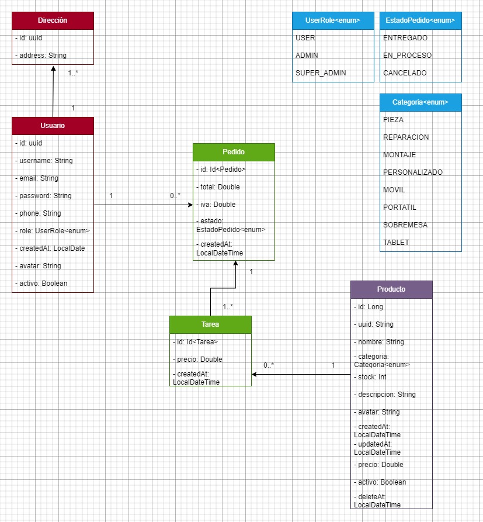

# ***Super Technology***

---

## _¿Qué es Super Technology?_

Es un servicio de gestión de usuarios, pedidos y productos de una tienda de informática, 
compuesta por tres microservicios distintos: el de usuarios, el de pedidos y el de productos. 

Creado como proyecto grupal para las asignaturas de _Acceso a Datos_ y _Programación de Servicios y Procesos_, 
en el ***IES Luis Vives*** de ***Leganés***, y en el curso **2022 / 2023**.

---

## _Índice_

- [***Diseño***](#diseño)
- [***Funcionamiento de la aplicación***](#funcionamiento-de-la-aplicación)
- [***Swagger***](#swagger)
- [***Autores***](#autores)

---

## Diseño 

### [◼ ***Diagrama de clases***](images_readme/diagrama_clases.png)

Como se puede observar, hay tres microservicios: En rojo está el de los 
usuarios, en verde el de los pedidos y en morado el de los productos/servicios. 

El microservicio de usuarios contará con dos entidades, los propios usuarios y sus direcciones.
Un usuario tiene un id, un nombre de usuario, un email, un numero de teléfono, una 
contraseña, su rol, una fecha de generación, un avatar y si está o no activa su cuenta. 
Los primeros 4 campos mencionados no se podrán modificar, mientras que los otros campos sí.
Los usuarios cuentan también con una lista de direcciones, pero esta se guarda en una tabla a parte llamada Address.
Esta tabla tiene un id, el id del usuario al que pertenece y el nombre de la dirección. Se relaciona con el usuario mediante 
una relación Muchos (direcciones) a Uno (usuario), pero no tiene bidireccionalidad, ya que solo 
las direcciones tienen el id del usuario, y el usuario no tiene guardados los ids de las direcciones.
Una direccion no puede existir sin un usuario asociado, y un usuario debe tener al menos una dirección.

El microservicio de pedidos contará con otras dos entidades, los pedidos y las tareas de las que se componen.
Un pedido tendrá su id, precio total, iva, estado, fecha de generación, usuario al que pertenece y una lista de tareas.
Las tareas, por su parte, tendrán un id, producto, empleado que las creó, precio y fecha de generación.
Un pedido está compuesto de múltiples tareas, pero una tarea solo pertenece a un pedido, y un pedido no puede existir sin 
tener una tarea asociada.

El microservicio de productos y servicios contará con la entidad producto, que tendrá un id, uuid, 
nombre del producto o servicio, categoria, stock, una descripción, fecha de generación, de actualización y de borrado, 
y también contará con un precio y si está activo o no. La fecha de borrado simboliza cuando se ha desactivado por ultima vez 
el producto, ya que la actividad del mismo actúa a modo de "borrado lógico".

### [◼ ***Diagrama entidad-relacion***](images_readme/diagrama_entidad_relacion.png)

Las relaciones de nuestro sistema se pueden describir de la siguiente manera:
Los usuarios tienen una o varias direcciones y estas solo pertenecen a un usuario, 
y pueden comprar o vender cosas en nuestra tienda, 
mediante los pedidos. Un usuario puede hacer tantos pedidos como quiera, 
pero cada pedido pertenece a un único usuario. 

Los pedidos, a su vez, están compuestos de una o multiples tareas, 
las cuales solo pueden pertenecer a un pedido.

Por último, las tareas tienen asociado un producto, pero este producto puede 
estar presente en múltiples tareas distintas, siempre que su stock se lo permita.

### [◼ ***Estructura***](images_readme/organizacion.png)

El diagrama de estructura representa las diferentes comunicaciones de 
nuestra aplicación.

El usuario podrá conectarse a cualquiera de las tres apis, pero nunca a sus bases de datos directamente. 
La api de usuarios se encargará del logado y registro, así como de la creación y envío de tokens de sesión para 
ser usados en el resto de apis. También gestiona la información de dichos usuarios, y cuenta con 
una caché para las operaciones más comúnmente realizadas.

Si el usuario quiere realizar un pedido, se conectará a la api de pedidos, previo login en la de usuarios, y lo creará. 
La api de pedidos se comunicará con la de usuarios y productos para montar el pedido correctamente y 
posteriormente devolverlo. No tendrá una caché puesto que una vez realizado un pedido, no se espera que haya muchas futuras 
peticiones al mismo endpoint con los mismos datos, a diferencia de como sí puede pasar en las apis de 
productos y usuarios.

Si el usuario es un administrador y quiere crear un nuevo producto, puede acceder a la api de productos, previa autenticación, 
y administrar lo que necesite desde ahí. Esta api sí tendrá una cache, puesto que consumir determinados productos o listarlos todos 
son operaciones que sí son esperables de que ocurran a menudo.

La api de usuarios emplea una base de datos PostgreSQL con Spring, la de productos usa MariaDB también con Spring y por 
último, la de pedidos hace uso de MongoDB con Ktor. Todos los microservicios son reactivos debido a que 
hemos considerado que la reactividad nos aporta una mejor escalabilidad, ya que al no 
bloquear los hilos, en grandes volúmenes de peticiones podrían procesarse multiples concurrentemente.

---

## Funcionamiento de la aplicación

Los usuarios se loguearán o registrarán accediendo a los endpoints correspondientes del microservicio de usuarios, obteniendo 
de este el token de sesión. Este token lo utilizarán para el resto de operaciones de los distintos microservicios que 
requieran de autenticación o autorización, puesto que el token lleva consigo el rol del usuario y ese rol determinará a 
qué endpoints se puede acceder y a cuales no. Los tokens JWT tienen una duración de 2 días, por lo que una vez caduque un 
token, el usuario dejará de tener acceso a los microservicios hasta que se vuelva a loguear. 
Hay tres tipos de permisos: los usuarios normales, que tienen acceso principalmente a la realización de pedidos, ver su propia información, y 
consultar los productos disponibles; los usuarios administradores, que además de esos permisos, pueden también 
crear nuevos productos, consultar cosas como los productos no disponibles o 
todos los usuarios registrados, y borrar *lógicamente* las distintas entidades (ponerlas como inactivas); 
y por último los super administradores, que pueden acceder a todos y cada uno de los endpoints, 
incluidos los de borrado permanente o la creación de otros usuarios distintos a ellos mismos y con el rol que quieran.

---

## Swagger

- [Productos](https://localhost:6963/swagger/index.html)
- [Usuarios](https://localhost:6969/swagger/index.html)
- [Pedidos](http://localhost:8080/docs/index.html#/)

---

## Autores 

- [Mario Resa](https://github.com/Mario999X)
- [Daniel Rodríguez](https://github.com/Idliketobealoli)
- [Sebastián Mendoza](https://github.com/SebsMendoza)
- [Alfredo Rafael Maldonado](https://github.com/reyalfre)
- [Azahara Blanco](https://github.com/Azaharabl)
- [Roberto Blazquez](https://github.com/xBaank)
- [Iván Azagra](https://github.com/IvanAzagraTroya)